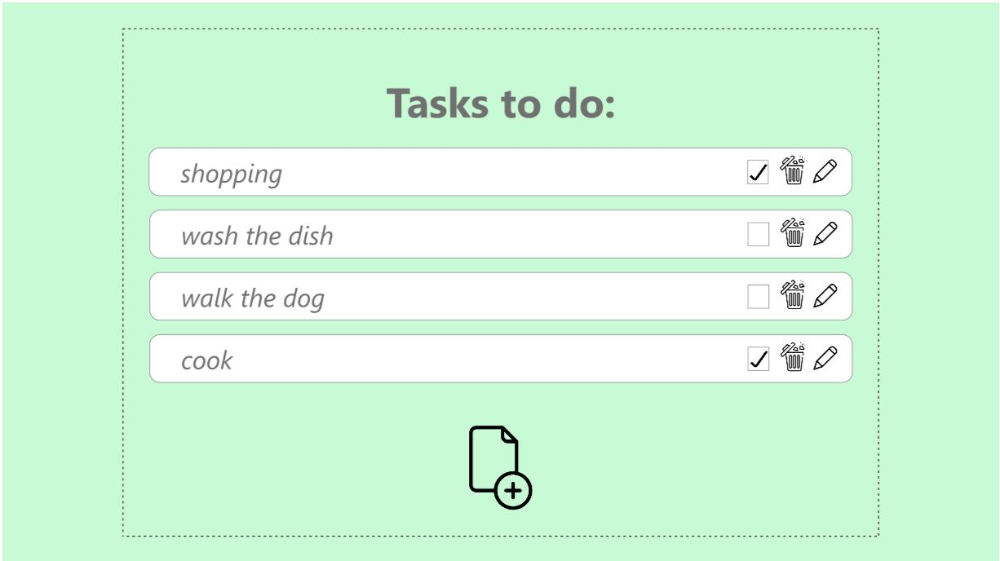
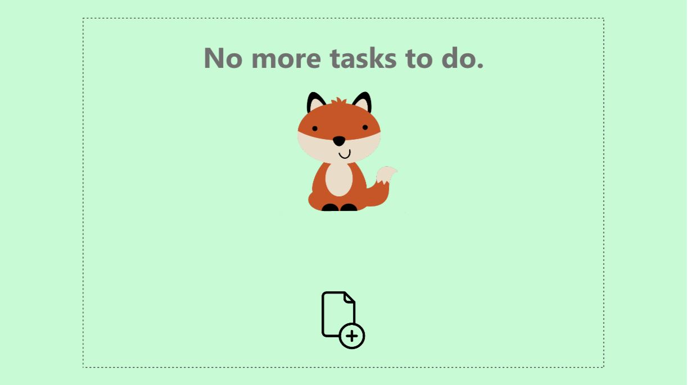

# Task Manager

# Summary
React project made created to manage tasks. It has two main states:
  - there are tasks:
      It shows the tasks. Each tasks can be marked as done, edited or deleted. Tasks have drag and drop property so to be reordered. 
  - there aren't tasks:
      Then it shows "No more tasks to do" screen with bouncing fox.
And there are button on the both screens for adding new tasks by pop up window form.

The app is responsive

# Application design

# Adobe Xd example Design

https://xd.adobe.com/view/6b9e4ef9-fc0c-4f5d-8b52-e36fe5fd1103-3ecd/

# Used 
  - React
  - Context
  - Reducer
  - Styled Components
  - flaticon for icons
  - uuid for generating ids
  - local storage to store the tasks
  - framer motion for bouncing fox 
  - react-beautiful-dnd for the drag and drop

***

Coded by Emilia Petkova
